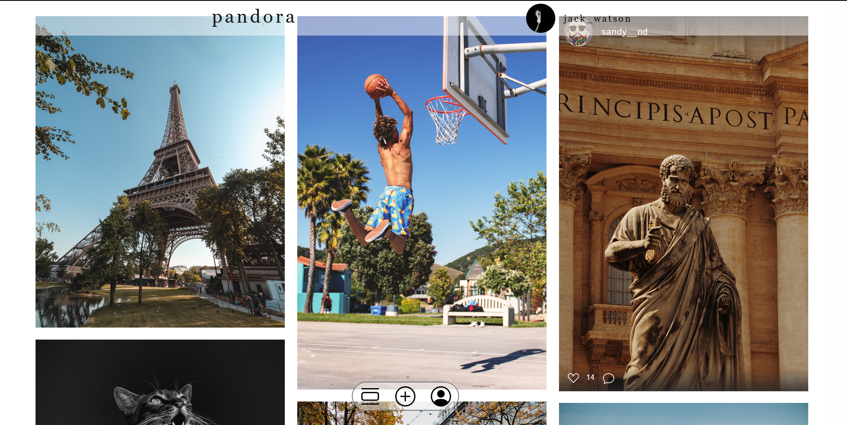
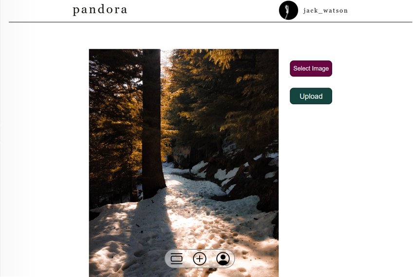
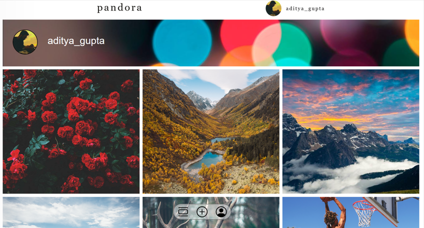

## React app for photo sharing

#### Dependencies:

- React
- Express
- Multer
- Dev dependencies
  - Parcel
  - Eslint
  - prettier

### Steps to make the app work:

1. Clone the repo and npm install

```sh
 git clone https://github.com/gaganjot99/socialapp.git
 cd socialapp
 npm i
```

2. Use parcel to build and npm to start the server

```sh
 npm run build
 npm start
```

> Replace build with "dev", if you want React in development mode

## Previews

#### Main View



#### Upload New PHOTO



#### Profile


